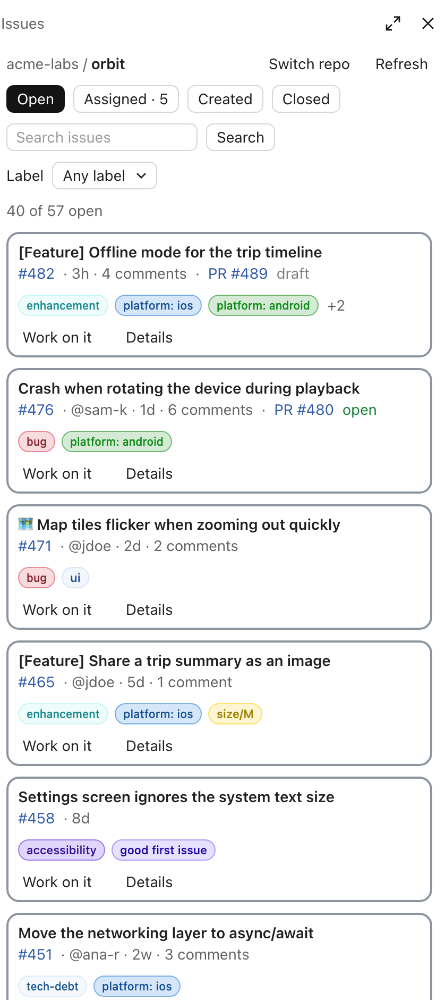

# claude-code-mods

Mods for [Claude Code](https://claude.com/claude-code): small plugins of function hooks that add panes, bands, status lines and behaviour to Claude Code, in the terminal and in the desktop app.

## Install

Add this repository as a marketplace, once:

```
/plugin marketplace add MarcoCarnevali/claude-code-mods
```

Then install any mod from the list below by its name, and reload:

```
/plugin install <mod>@marco-mods
/reload-plugins
```

To get new mods and updates later:

```
/plugin marketplace update marco-mods
```

A mod is code that runs inside Claude Code on your machine, with the same access Claude Code has. Read a mod's source before you install it.

## Mods

| Mod | What it does |
| --- | --- |
| [build-monitor](#build-monitor) | A pane that opens by itself when Claude runs a build (Xcode, Gradle, SwiftPM, fastlane, Flutter, React Native): a timer against the last run, the failed tests and errors, **Ask Claude to fix**, and the build's trend. |
| [github-issues](#github-issues) | A side pane listing a repository's GitHub issues. Filter and search them, read one, and press **Work on it** to hand it to Claude. |

### build-monitor


A pane that opens as soon as Claude starts a build (`xcodebuild`, Gradle, `swift build`, a fastlane lane, `flutter build`, `react-native run-*` or `expo run:*`): a ring timer and progress bar against the build's last successful run, then the result. A failed build lists its failed tests and errors with the code they point at, **Open in Xcode / Android Studio**, and **Ask Claude to fix**; any build shows a readable log and its command. `/builds` opens it any time.

```
/plugin install build-monitor@marco-mods
```

[Read more](./build-monitor/README.md)

### github-issues



A side pane listing a repository's GitHub issues as cards, with tabs, search, a label filter and linked pull requests. `/issues` opens it on the repository of the folder you started Claude Code in, or a picker of your repositories outside one. **Work on it** sends Claude a prompt to take on an issue. Needs the [GitHub CLI](https://cli.github.com), signed in.

```
/plugin install github-issues@marco-mods
```

[Read more](./github-issues/README.md) · [Watch the demo](https://x.com/marcocarne_/status/2107456270873796697)

## Developing

Each mod is a folder at the root of this repository:

```
<mod>/
├── .claude-plugin/plugin.json   manifest
├── hooks/hooks.json             { "modules": ["./register.tsx"] }
├── hooks/register.tsx           the hooks module: export const register: Register = on => { ... }
├── types/index.d.ts             the $.state values the mod keeps
├── tests/*.test.ts              run by `claude plugin test`
└── README.md
```

Check and test a mod:

```bash
claude plugin validate ./<mod>
claude plugin test ./<mod>
```

Function-hook plugins are in early access: if `claude plugin test` says so, set `CLAUDE_CODE_ENABLE_FUNCTION_HOOKS=1`. CI ([`test-mods.yml`](./.github/workflows/test-mods.yml)) validates and tests every mod on each push and pull request, and [`plugin-scan.yml`](./.github/workflows/plugin-scan.yml) runs the HOL plugin scanner.

Run Claude Code with a mod loaded from this folder. It reloads whenever you save:

```bash
claude --plugin-dir ./<mod>
```

Claude Code writes the API's type declarations into `<mod>/.claude-plugin/types/` when it loads a mod from disk. That folder is ignored by git. After a load, the mod's `tsconfig.json` picks those declarations up, so your editor and `tsc -p <mod>` can type-check it.

### Adding a mod

1. Create its folder at the root, laid out as above.
2. Add an entry to [`.claude-plugin/marketplace.json`](./.claude-plugin/marketplace.json): its `name`, `source` (`./<mod>`), `description` and `version`.
3. Add it to the [Mods](#mods) table and give it a section of its own, with a screenshot and its install line.
4. Write tests for it in `<mod>/tests/`: CI runs them with the others.
5. Check the marketplace still validates: `claude plugin validate .`

## License

[MIT](./LICENSE)
