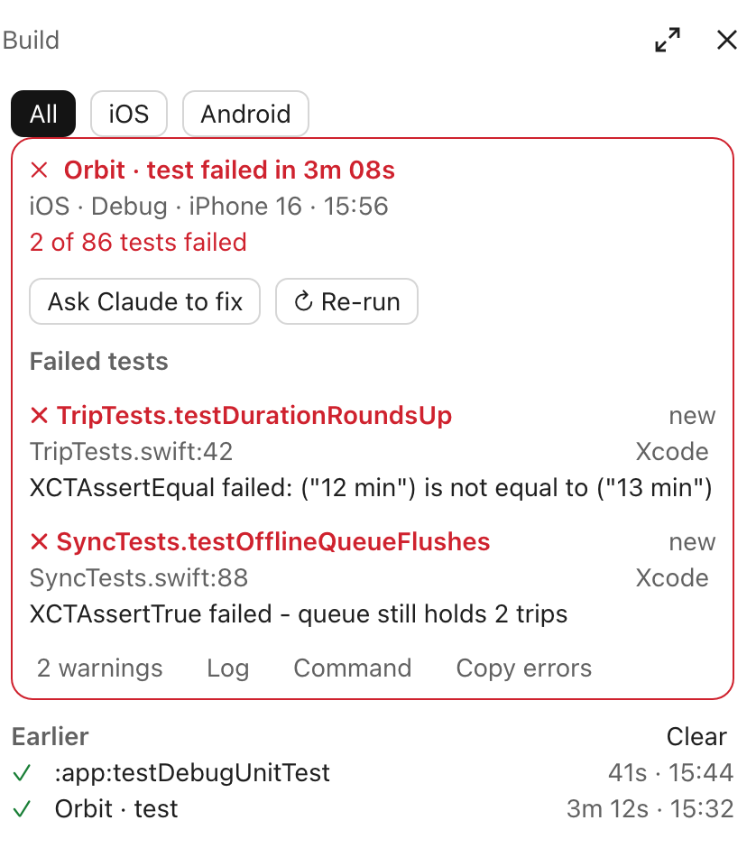

# build-monitor

A status pane that opens by itself when Claude runs a build: Xcode, Gradle, SwiftPM, fastlane, Flutter or React Native (Expo included).



<sub>The screenshot shows a made-up app and builds.</sub>

- **Opens on its own** as soon as Claude starts a build, before it runs: `xcodebuild`, `./gradlew` or `gradle`, `swift build` / `swift test`, a fastlane lane, `flutter build`, `react-native run-ios` / `run-android`, or `expo run:ios` / `run:android`.
- **While it builds:** a ring timer with the time so far, what is building (scheme and action, or Gradle tasks), the configuration and device. When the same build ran before, the ring and a progress bar fill against its last successful run, with the time left ("of ~2:16", "About 52s left"); the first time, the ring turns.
- **When it ends:** succeeded or failed with the duration, how it compares with the last run ("12s faster than last"), error and warning counts, test results with the failed tests by name, and the errors as `file:line` with their messages. A toast says the same, for when you are looking elsewhere.
- **When it fails:** the card reads top to bottom: what failed and how ("2 of 4 tests failed · 1 error"); **Ask Claude to fix** and **Re-run**; the failed tests, each with the assertion that failed and where, marked *new* or how often it failed in the runs kept; then the errors, each with the code it points at. A failed assertion counts as its test's failure, not as a build error. **Ask Claude to fix** hands Claude the command, the errors and the failed tests, asking it to fix them and run the build again; Claude Code holds that prompt until Claude finishes what it is doing, and the button says so. **Re-run** asks Claude to run the same command again.
- **Under any finished build:** links to its warnings, its log and its command, one open at a time, and on a failed build **Copy errors**.
- **Open in Xcode / Android Studio / Editor:** each error and warning opens its file at its line: Apple sources through `xed`, Kotlin and Java through Android Studio's `studio` launcher (without it, Android Studio opens the file at its start), Dart, JavaScript and TypeScript in the file's default app.
- **Log and Command:** the whole command line, the build's flags one to a line; and the build's log, made readable: each step a short line (a run of compiles folded into one: "Compiling Trip.swift, Map.swift and 12 more"), errors and warnings with the code they point at, tests passed and failed, and the result. The compiler's own command lines, thousands of characters each, are left out. **Open full log** opens the whole output in your text editor, when it was long enough for Claude Code to keep it in a file.
- **Trend:** once a build has run three times, the card charts its last ten runs: a bar each (failed runs red, this one in the accent color) over a dashed median, and "median 2m 11s · 13s faster".
- **Earlier:** the project's last ten builds, across sessions, with their result, duration and when they ran (an earlier day's show its date). Tap one to see it in the card, **Latest** to go back, **Clear** to empty the list. Because the history is kept, the timer and the test badges know yesterday's builds from the first build of the day. The history is kept per repository, for the ten repositories built in most recently, without the builds' logs.
- **Filter:** with builds for more than one platform, **All · iOS · macOS · Android** narrows the card and the list to one.

`/builds` opens the pane at any time.

## What counts as a build

The first word of each command in the line decides, so `cd ios && xcodebuild …`, `set -o pipefail && xcodebuild … | xcpretty` and `NSUnbufferedIO=YES xcrun xcodebuild …` all count, as do `npx`, `bunx`, `bundle exec`, `pnpm exec` and `yarn` in front of a tool. Commands that only ask for information don't open the pane: `xcodebuild -list`, `-showBuildSettings`, `-version`, Gradle's `tasks`, `dependencies`, `help` and `--version`, `swift package`, fastlane's `lanes`, `init` and the like, and the dev servers (`expo start`, `react-native start`).

| Command | Platform | Its output, read as |
| --- | --- | --- |
| `xcodebuild` | iOS, or macOS for a Mac destination or SDK | Xcode's |
| `gradle`, `./gradlew` | Android | Gradle's, with Kotlin and javac diagnostics |
| `swift build`, `swift test` | macOS | the Swift compiler's, XCTest's and Swift Testing's; `Build complete!` |
| `fastlane [ios\|android\|mac] <lane>` | from the lane, iOS without one | the Xcode or Gradle output it runs, its `[!]` errors, and `fastlane finished with errors` |
| `flutter build apk\|appbundle\|ios\|ipa\|macos` | from the target | Dart's `file:line:column: Error:`, then Xcode's or Gradle's; `✓ Built` |
| `react-native run-ios\|run-android`, `expo run:ios\|run:android` | from the command | Xcode's or Gradle's, with their `success` and `error Failed to build` lines |

`flutter test` and `flutter run` stay out: neither builds for one platform, and `run` does not end.

Errors are read from the full output: Xcode's `file:line: error:` lines and `** BUILD FAILED **` markers, Kotlin's `e:` and `w:` lines, `javac` errors, and Gradle's `BUILD FAILED` and "What went wrong". Test counts come from `Executed N tests, with M failures` and Gradle's `N tests completed, M failed`. Failed tests are named from XCTest's `Test Case '…' failed` lines (old and new forms), Swift Testing's `✘ Test … failed after` (and the SF Symbol Xcode prints in place of the ✘), and Gradle's `Class > test() FAILED`. The log also reads what xcpretty and xcbeautify print, when the build is piped through one.

## Limits

- The pane shows progress, not the log as it scrolls: Claude Code hands a mod a command's output once the command ends.
- A build Claude sends to the background is marked "Running in the background". Its result goes to Claude, not to the pane.
- Claude, not you, starts the build, so the pane opens unasked. The desktop app shows it. A terminal shows it from 144 columns wide, and narrower than that the toast still tells you how the build ended.

The mod reads nothing but the output of the builds Claude runs, and makes no network calls. Its one command of its own is the editor that **Open** starts when you press it.

## Install

```
/plugin marketplace add MarcoCarnevali/claude-code-mods
/plugin install build-monitor@marco-mods
/reload-plugins
```
